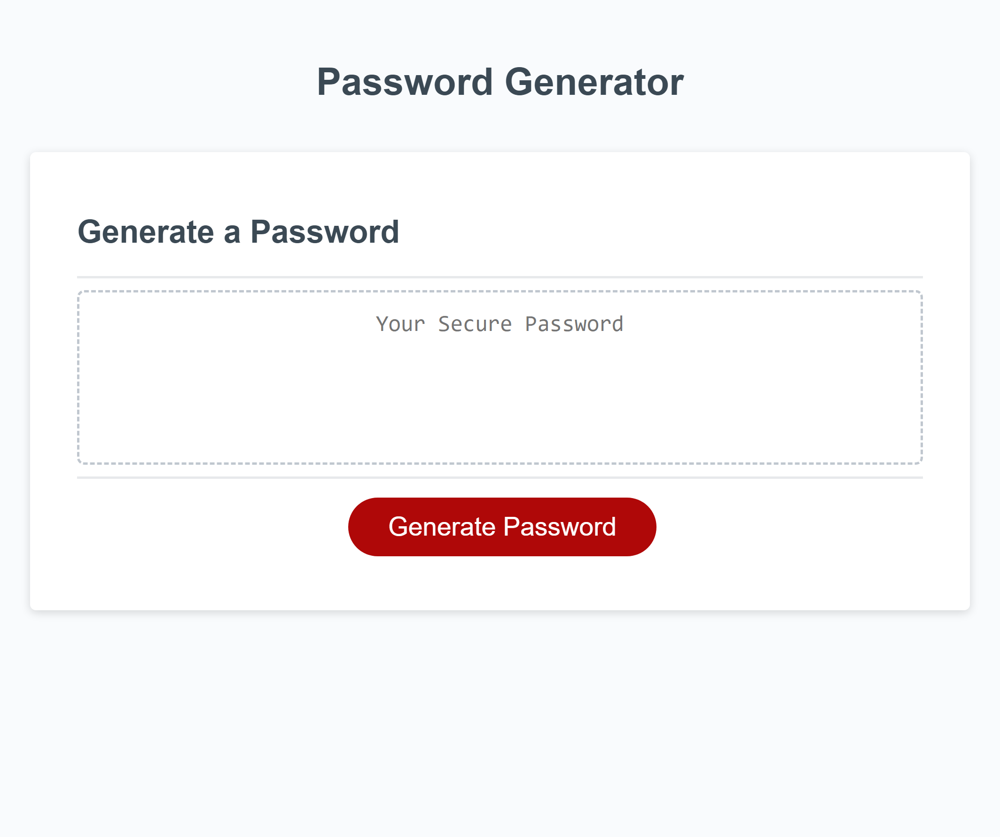

# Unique-Password Generator 

## Description

The Password Generator was created to offer anyone in need of a unique, exceptionally secure, and totally randomly generated password.

 A limitless amount of potential passwords can be generated for any user simply by visiting the website, and answering a few breif questions. This offers any user the abitlity to have a security in their passphrase that they would likely not have if created on their own. It also removes the difficutly of creating ones own secure password, or of using the same password for multiple applications, thus lessening security. 

## Mockup

## Table of Contents

 Not necessary. <!--I dont believe a table of contents are necessary here. If I have this wrong however please correct me.:/} -->

## Testing

While creating this program, I tested my code very little. I spent most of this project working closely with a detail oriented tutor, who thoroughly guided and helped me understand every line of code I created with her. Creating this program solely on my own was not feasable, as the concepts I have learned, I have only just barely been able to learn to read. Working together was the most fruitful way for me to understand what I needed to do and how I needed to think. 
Any testing was done by using the inspect tool and referring to the console. In specific I looked at how the arrays were being saved in memory, and how many special caracters were made available depending on the users choice of the password length.

## Deployed Links

GitHub Password Gen. Repo Link:
https://github.com/TrevorsDev/passwordGenerator

Deployed link:
https://trevorsdev.github.io/passwordGenerator/

<!--## Installation

There are no installation steps to follow, simply visiting the website is sufficient.

## Usage

Not applicable, open in live server.

## Credits

List your collaborators, if any, with links to their GitHub profiles.

If you used any third-party assets that require attribution, list the creators with links to their primary web presence in this section.

If you followed tutorials, include links to those here as well.

## License
No license

The last section of a high-quality README file is the license. This lets other developers know what they can and cannot do with your project. If you need help choosing a license, refer to [https://choosealicense.com/](https://choosealicense.com/).

---

🏆 The previous sections are the bare minimum, and your project will ultimately determine the content of this document. You might also want to consider adding the following sections.

## Badges
No badges 

Badges aren't necessary, but they demonstrate street cred. Badges let other developers know that you know what you're doing. Check out the badges hosted by shields.io. You may not understand what they all represent now, but you will in time.

## Features
None needed to be explained

If your project has a lot of features, list them here.

## How to Contribute
If you created an application or package and would like other developers to contribute to it, you can include guidelines for how to do so. The Contributor Covenant is an industry standard, but you can always write your own if you'd prefer.

## Tests
Go the extra mile and write tests for your application. Then provide examples on how to run them here. -->